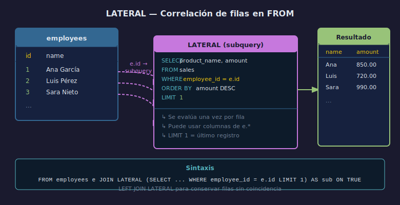

# 01 — ¿Qué es LATERAL?

## Objetivos

1. Comprender qué permite `LATERAL` que un `JOIN` ordinario no puede.
2. Identificar la sintaxis básica de `JOIN LATERAL`.
3. Reconocer el patrón de correlación entre tablas en `FROM`.

## Diagrama



---

## 1. El problema que resuelve LATERAL

En un `JOIN` ordinario, la subquery en `FROM` no puede hacer referencia
a columnas de las tablas que aparecen antes en la misma cláusula.

```sql
-- ❌ ERROR: no se puede correlacionar en un JOIN ordinario
SELECT e.id, e.name, last_sale.amount
FROM employees e
JOIN (
    SELECT amount
    FROM sales
    WHERE sales.employee_id = e.id   -- e.id no está en scope
    ORDER BY amount DESC LIMIT 1
) AS last_sale ON TRUE;
```

---

## 2. LATERAL habilita la correlación

Con `LATERAL`, la subquery puede referenciar columnas de tablas anteriores.

```sql
-- ✅ CORRECTO con LATERAL
SELECT e.id, e.name, last_sale.amount
FROM employees e
JOIN LATERAL (
    SELECT amount
    FROM sales
    WHERE sales.employee_id = e.id   -- e.id SÍ está en scope
    ORDER BY amount DESC LIMIT 1
) AS last_sale ON TRUE;
```

---

## 3. Comportamiento con filas sin coincidencia

`JOIN LATERAL` excluye filas sin coincidencia (como `INNER JOIN`).

```sql
-- LEFT JOIN LATERAL conserva empleados sin ventas (amount = NULL)
SELECT e.id, e.name, last_sale.amount
FROM employees e
LEFT JOIN LATERAL (
    SELECT amount FROM sales
    WHERE sales.employee_id = e.id
    ORDER BY amount DESC LIMIT 1
) AS last_sale ON TRUE;
```

---

## 4. Checklist

- ¿Qué ocurre si quito `LATERAL` en una subquery correlacionada?
- ¿Cuándo usaría `LEFT JOIN LATERAL` en lugar de `JOIN LATERAL`?
- ¿Qué diferencia existe entre correlación en `WHERE` y en `FROM LATERAL`?
- ¿Puede `LATERAL` referenciar una tabla definida después de él en `FROM`?

## Referencias

- https://www.postgresql.org/docs/16/queries-table-expressions.html#QUERIES-LATERAL
- https://www.postgresqltutorial.com/postgresql-tutorial/postgresql-lateral-join/
