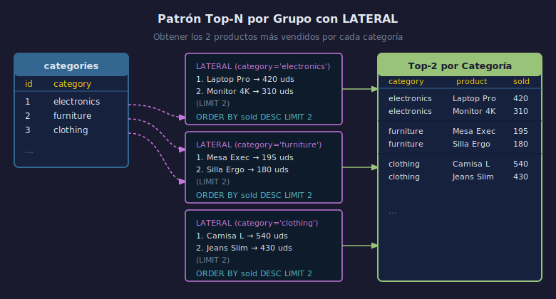

# 02 — CROSS JOIN LATERAL y funciones tabulares

## Objetivos

1. Distinguir `JOIN LATERAL` de `CROSS JOIN LATERAL`.
2. Llamar funciones `RETURNS TABLE` desde la cláusula `FROM`.
3. Entender cuándo `CROSS JOIN LATERAL` es más legible que una subquery.

## Diagrama



---

## 1. CROSS JOIN LATERAL

Cuando no necesitas condición `ON`, usa `CROSS JOIN LATERAL`:

```sql
-- Equivalente a JOIN LATERAL ... ON TRUE
SELECT e.id, e.name, top3.product_name
FROM employees e
CROSS JOIN LATERAL (
    SELECT product_name
    FROM sales
    WHERE sales.employee_id = e.id
    ORDER BY amount DESC
    LIMIT 3
) AS top3;
```

> `CROSS JOIN LATERAL` produce el producto cruzado,
> pero la subquery se evalúa por cada fila de la tabla izquierda.

---

## 2. Funciones tabulares en FROM con LATERAL

Una función `RETURNS TABLE` puede usarse como si fuera una tabla:

```sql
-- Función de ejemplo
CREATE OR REPLACE FUNCTION fn_top_sales(p_emp_id INT, p_limit INT)
RETURNS TABLE (product_name TEXT, amount NUMERIC)
LANGUAGE sql AS $$
    SELECT product_name, amount
    FROM sales
    WHERE employee_id = p_emp_id
    ORDER BY amount DESC
    LIMIT p_limit;
$$;

-- Llamada con LATERAL
SELECT e.name, ts.product_name, ts.amount
FROM employees e
CROSS JOIN LATERAL fn_top_sales(e.id, 3) AS ts;
```

---

## 3. Comparación: subquery vs LATERAL con función

```sql
-- Sin LATERAL — subquery correlacionada (menos reutilizable)
SELECT e.name,
       (SELECT MAX(amount) FROM sales WHERE employee_id = e.id) AS max_sale
FROM employees e;

-- Con LATERAL — más flexible cuando necesitas múltiples columnas
SELECT e.name, s.max_amount, s.min_amount
FROM employees e
CROSS JOIN LATERAL (
    SELECT MAX(amount) AS max_amount,
           MIN(amount) AS min_amount
    FROM sales WHERE employee_id = e.id
) AS s;
```

---

## 4. Checklist

- ¿Cuándo es más legible `CROSS JOIN LATERAL` que una subquery en `SELECT`?
- ¿Puede una función `RETURNS TABLE` recibir columnas de la fila actual?
- ¿Qué pasa si la función no retorna filas para un `CROSS JOIN LATERAL`?
- ¿Cómo se diferencia `CROSS JOIN LATERAL` de `CROSS JOIN` simple?

## Referencias

- https://www.postgresql.org/docs/16/functions-srf.html
- https://www.postgresql.org/docs/16/xfunc-sql.html
